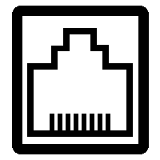

# Connectors

<p float="center">
  
  
  
  
  
</p>
Image generator for (mostly notwork) connectors like RJ45.

## Screenshots

    Web UI for generating image URL:

<p align="center">
  
</p>

Exanple usage in google sheet:

<p align="center">
  
</p>

## Docker

## Configuration

### Env variables

* ```CONNECTORS_IMAGE_CACHE_MB``` - [sharp maximum cache memory](https://sharp.pixelplumbing.com/api-utility#cache)
  
### Docker compose
