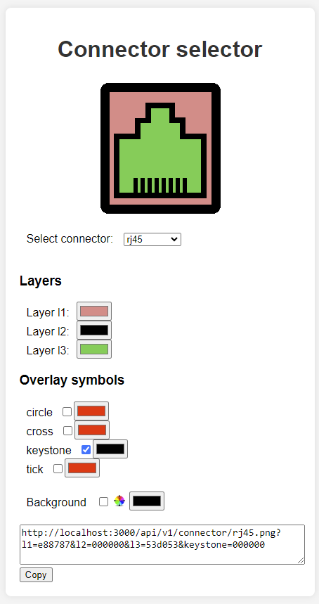
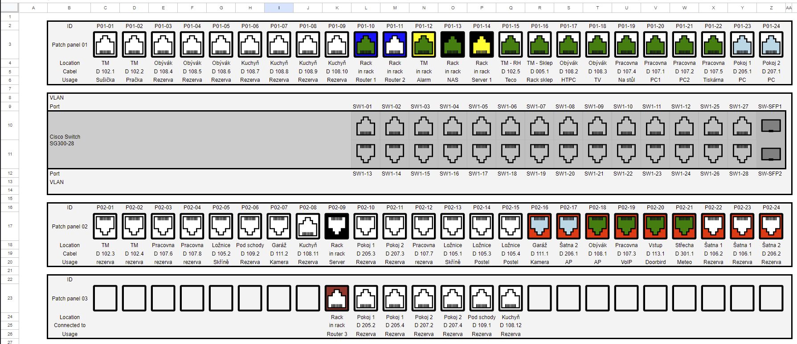

# connectors

<p align="center">
  
</p>
Image generator for (mostly notwork) connectors like RJ45.


## Screenshots
Web UI for generating image URL:
<p align="center">
  
</p>
Exanple usage in google sheet:
<p align="center">
  
</p>
## Docker

## Configuration

### Env variables
* ```CONNECTORS_IMAGE_CACHE_MB``` - [sharp maximum cache memory](https://sharp.pixelplumbing.com/api-utility#cache)
### Docker compose 

